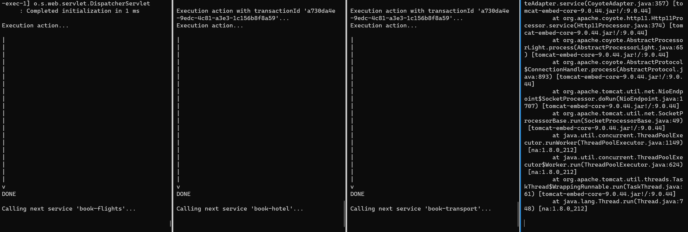

# Propeller - Project X March 2021

You need to have a k8 cluster running.

## Demo

1. Start the services
   
    kubectl apply -f kubernetes.yaml
    
2. Observe all the services
   
   kubectl logs -f deployment.apps/plan-meeting
   kubectl logs -f deployment.apps/book-flights
   kubectl logs -f deployment.apps/book-hotel
   kubectl logs -f deployment.apps/book-transport
   
3. Send a request to the first service

    curl http://localhost:8080/action
   
If not run on Docker Desktop, then change `localhost` to your LoadBalancer IP.

4. Observe services calling each other.

    